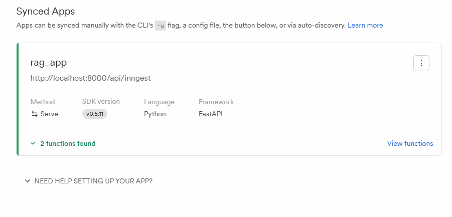

# RAG App with FastAPI, Streamlit, LlamaIndex, Gemini & Qdrant


A **Retrieval-Augmented Generation (RAG) application** that leverages AI for intelligent document processing. Built with **FastAPI** backend, **Streamlit** frontend, **LlamaIndex** & **Gemini** for AI, and **Qdrant** for vector storage. Supports PDFs document uploads with efficient data ingestion pipelines.  

---

## 🔹 Features
- Upload PDFs documents  
- AI-powered information retrieval    
- Store and query vectors efficiently using Qdrant  
- Dockerized setup for easy deployment  

---

## 🛠 Tech Stack
- **Backend:** FastAPI  
- **Frontend:** Streamlit  
- **AI / RAG:** LlamaIndex, Gemini  
- **Vector DB:** Qdrant  
- **Containerization:** Docker  

---

## 📸 Demo



---

## 🚀 Installation

### Clone the repository
```bash
git clone https://github.com/far-hana5/RAG-App
```

```bash
python -m venv env
source env/bin/activate  
pip install -r requirements.txt

